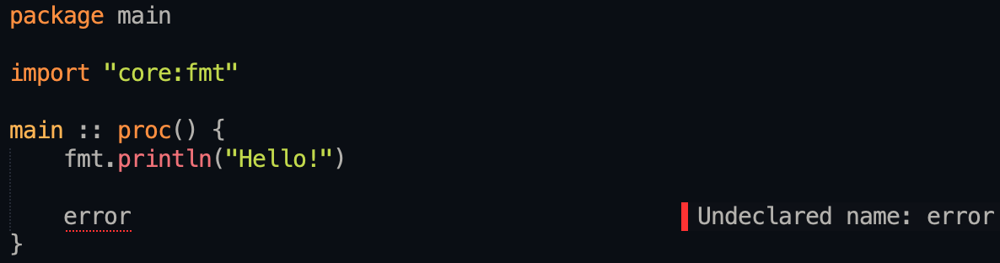

# OdinErrors


Shows Odin Lang errors in Sublime Text.

# Config
Collections and defines are stored in `ols.json` (Hijacked from [ols](https://github.com/DanielGavin/ols)).
```json
{
    "collections": [
        {
            "name": "core",
            "path": "~/Odin/core"
        },
        {
            "name": "vendor",
            "path": "~/Odin/vendor"
        }
    ],
    "defines": [
        {
            "name": "FOO",
            "value": "bar"
        }
    ],
    ...
}
```
